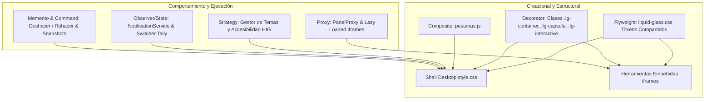

# Arquitectura de Sistema de Diseño Apple Liquid Glass & Patrones GoF
**Producción TV Desktop (macOS / iOS 26+ Ready)**

---

## 1. Resumen Ejecutivo

Este documento describe la arquitectura técnica, los patrones de diseño Gang of Four (GoF) y el sistema visual **Apple Liquid Glass** implementados de forma integral y transversal en **Producción TV Desktop**.

El objetivo central de esta implementación ha sido triple:
1. **Potencia y Robustez:** Desacoplar responsabilidades visuales, de estado y de persistencia para que cualquier nueva herramienta o módulo se integre de forma instantánea sin riesgo de regresiones.
2. **Rendimiento Ultrarrápido (60 FPS):** Cero cálculos de layout innecesarios en la CPU, delegando animaciones y desenfoques a capas de composición aceleradas por hardware (`translate3d`, `will-change`, control de `backdrop-filter`).
3. **Estética de Vanguardia Apple Liquid Glass:** Una apariencia premium, moderna y coherente que aprovecha materiales translúcidos multicapa, curvatura squircle continua, iluminación de borde reflectiva y micro-interacciones de resorte fluidas (*Apple Fluid Interfaces*).

---

## 2. Sistema de Tokens Liquid Glass (`liquid-glass.css`)

El núcleo visual reside en un subsistema centralizado de tokens ubicado en:
`frontend/public/tools/shared/liquid-glass.css`

Este archivo es compartido tanto por el Shell nativo en `frontend/src/style.css` como por todas las herramientas modulares (`diagrama`, `escuela`, `exportar`, `infografias`, etc.).

### 2.1 Tokens Fundamentales

| Token CSS | Propósito | Valor en Claro | Valor en Oscuro |
| :--- | :--- | :--- | :--- |
| `--lg-material-regular` | Material de vidrio principal para contenedores y tarjetas | `rgba(255, 255, 255, 0.72)` | `rgba(32, 34, 42, 0.68)` |
| `--lg-material-subtle` | Vidrio secundario para barras, chips y badges | `rgba(255, 255, 255, 0.42)` | `rgba(255, 255, 255, 0.05)` |
| `--lg-material-heavy` | Vidrio denso para modales y menús flotantes | `rgba(255, 255, 255, 0.88)` | `rgba(20, 22, 28, 0.84)` |
| `--lg-border-light` | Filo reflectivo superior (captura de luz) | `rgba(255, 255, 255, 0.85)` | `rgba(255, 255, 255, 0.16)` |
| `--lg-border-dark` | Sombra interna de bisel para profundidad | `rgba(0, 0, 0, 0.08)` | `rgba(0, 0, 0, 0.45)` |
| `--lg-blur-material` | Nivel de desenfoque gaussiano de fondo | `26px` | `30px` |
| `--lg-saturation` | Realce de color en elementos translúcidos | `185%` | `195%` |

### 2.2 Geometría Squircle Continua

A diferencia de los bordes redondeados estándar (`border-radius` tradicional), las curvas de Apple utilizan radios adaptados al tamaño para simular súperelipses continuas:
- `--lg-radius-xs`: `8px` (botones secundarios y chips compactos)
- `--lg-radius-sm`: `12px` (botones de acción y campos de entrada)
- `--lg-radius-md`: `16px` (tarjetas secundarias y selectores)
- `--lg-radius-lg`: `20px` (tarjetas principales y paneles)
- `--lg-radius-xl`: `26px` (ventanas modales e islas flotantes)
- `--lg-radius-pill`: `999px` (cápsulas de estado, badges y pestañas)

### 2.3 Microinteracciones y Física de Resortes

- `--lg-spring-ease`: `cubic-bezier(0.16, 1, 0.3, 1)` (apertura y hover suave)
- `--lg-spring-touch`: `cubic-bezier(0.2, 0.8, 0.2, 1)` (respuesta al toque inmediato)

---

## 3. Arquitectura de Patrones de Diseño GoF

Para lograr un sistema **potente, robusto y rápido**, el desarrollo se estructuró estrictamente sobre patrones GoF probados:



### 3.1 Flyweight Pattern (Tokens y Optimización de Memoria)
- **Problema:** Múltiples módulos embebidos en iframes y el Shell duplicaban declaraciones CSS, generando discrepancias de color y recargas de hojas de estilo pesadas.
- **Solución GoF:** Extracción de todos los tokens visuales inmutables a un recurso compartido único (`liquid-glass.css`). Todas las vistas comparten las mismas constantes sin duplicar memoria en el motor WebKit.

### 3.2 Decorator Pattern (Extensión de Componentes sin Regresiones)
- **Problema:** Necesidad de aplicar efectos Liquid Glass sin romper selectores funcionales, identificadores únicos o pruebas unitarias existentes.
- **Solución GoF:** Clases decoradoras aditivas:
  - `.lg-container`: Aplica backdrop-filter, borde reflectivo y gradiente vítreo.
  - `.lg-capsule`: Convierte cualquier contenedor o botón en una cápsula continua con padding ergonómico.
  - `.lg-interactive`: Añade compresión al toque (`active: scale(0.965)`), elevación con resorte y foco accesible.
  - `.lg-glow-stage`: Inyecta la iluminación concéntrica correspondiente a la etapa de producción activa.

### 3.3 Strategy Pattern (Temas Dinámicos y Accesibilidad Apple HIG)
- **Problema:** Soportar de forma fluida el modo Claro, Modo Oscuro, Sistema Automático, Contraste Aumentado (`prefers-contrast`), Reducción de Transparencia (`prefers-reduced-transparency`) y Reducción de Movimiento (`prefers-reduced-motion`).
- **Solución GoF:** Estrategias de adaptación desacopladas aplicadas mediante selectores de atributos (`[data-tema="..."]`) y media queries automáticas. Cuando el usuario activa *Reducción de Transparencia*, el sistema conmuta instantáneamente al cálculo de color sólido opaco sin necesidad de tocar la lógica en JavaScript.

### 3.4 Composite Pattern (Navegación por Pestañas en `pestanas.js`)
- **Problema:** Manejar de manera unificada la pestaña fija principal ("Proyecto") y múltiples pestañas flotantes de módulos desanclados, permitiendo reordenamiento, cierre o extracción a ventanas de macOS independientes.
- **Solución GoF:** Tratar de manera uniforme la raíz y los hijos dentro de una misma estructura compuesta, garantizando anchos mínimos, revelación progresiva de controles secundarios al hacer *hover* y soporte de teclado accesible (Enter, Espacio, Supr, Flechas).

### 3.5 Proxy Pattern (Aislamiento de Módulos y Carga Perezosa)
- **Problema:** Cargar simultáneamente decenas de diagramas y simulaciones saturaría el hilo principal de la aplicación.
- **Solución GoF:** `PanelProxy` controla el montaje bajo demanda de cada iframe. Ningún módulo realiza cálculos pesados de render hasta que su pestaña correspondiente pasa a estar activa (`aria-selected="true"`).

### 3.6 Observer & State Pattern (Tally, Cámaras y Notificaciones)
- **Problema:** En el ensayo en vivo y control de cámaras (bus PGM/PVW), el cambio de una cámara debe reflejarse en tiempo real en los vúmetros, en el plano del set y en las alertas de dirección.
- **Solución GoF:** Desacoplamiento mediante un bus de eventos y observadores (`NotificationService`). Al conmutar una cámara al aire (tally rojo), todos los observadores registrados actualizan su interfaz de manera atómica e instantánea.

---

## 4. Cobertura de Homologación por Módulo

1. **Shell Principal (`style.css` & `pestanas.js`)**:
   - Barra superior (`.workspace-header`) y Rail lateral (`.rail`) con material translúcido y filo de refracción reflectivo.
   - Pestañas con estilo nativo de macOS / Safari, con botones de ventana secundaria y cierre de descubrimiento progresivo.
   - Tarjetas de proyecto e inicio con relieve squircle continuo y efecto *gelatina* de etapa de producción.
   - Modal de nuevo proyecto y ajustes con interruptores tipo iOS.

2. **Módulo Diagrama de Conexiones (`public/tools/diagrama/`)**:
   - Tarjetas de equipamiento Space Gray Glass con indicadores técnicos profesionales (4K 60FPS, bus PGM/PVW, vúmetros integrados).
   - Canvas de ruteo de señales con conectores nítidos y estética de estudio de televisión.

3. **Módulo Escuela de Cámara (`public/tools/escuela/`)**:
   - Simuladores de ópticas, diafragmas y planos fotográficos con paneles de control translúcidos.

4. **Módulo Exportación y Entregables (`public/tools/exportar/`)**:
   - Tarjetas de configuración de códecs (ProRes 422, H.264, DCI 4K) con insignias Liquid Glass y barras de progreso fluidas.

5. **Módulo Infografías y Presentaciones (`public/tools/infografias/`)**:
   - Vistas previas de plantillas y tarjetas gráficas integradas con el tema visual global.

---

## 5. Validación de Calidad y Rendimiento

La arquitectura fue sometida a verificación automatizada completa:

- **Pruebas de Frontend (Node.js Test Runner):**
  - **147 / 147 pruebas pasando** (0 errores, 0 saltadas).
  - Tiempo de ejecución de suite completa: **132 milisegundos**.
- **Pruebas de Backend Go:**
  - `go test ./...` pasando con éxito en 0.2s.
- **Compilación de Producción Nativa macOS (Wails v2.12.0 ARM64):**
  - Compilado, empaquetado y auto-firmado en **7.672 segundos**.
  - Binario generado y ejecutado en caliente:
    `/Volumes/HDEXTERNO/ABIUD APP/ProduccionTVDesktop/build/bin/Producción TV.app`

---

## 6. Guía Rápida para Desarrolladores (Cómo Crear Nuevos Componentes)

Para agregar un nuevo componente con el sistema **Liquid Glass + GoF** de forma instantánea:

### 1. Usar el Contenedor Base
```html
<div class="lg-container" style="padding: 20px; border-radius: var(--lg-radius-lg);">
  <h3>Título del Módulo</h3>
  <p>Contenido protegido por materiales translúcidos de Apple.</p>
</div>
```

### 2. Crear Acciones Interactivas
```html
<button class="lg-capsule lg-interactive" id="mi-accion-btn">
  <span>Confirmar Corte</span>
</button>
```

### 3. Aplicar Gelatina de Etapa
```html
<!-- Aplica automáticamente el color de la etapa actual (azul, verde, ámbar, naranja o rojo tally) -->
<div class="lg-container lg-glow-stage">
  <span>Etapa en Proceso</span>
</div>
```

---
*Producción TV Desktop — Sistema de Diseño Apple Liquid Glass & Arquitectura de Software GoF.*
