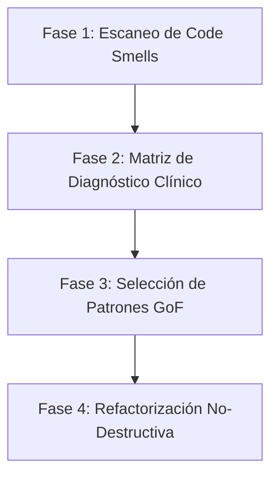

# Skill: Arquitecto Universal de Software (23 Patrones de Diseño GoF)

Este skill es un marco de trabajo de ingeniería de software para que cualquier Agente de IA inspeccione, audite, diagnostique y mejore cualquier base de código (JavaScript/TypeScript, Python, C++, C#, Java, Go, Rust, etc.) aplicando de forma quirúrgica los **23 Patrones de Diseño clásicos del Gang of Four (GoF)**.

---

## 🧭 PROTOCOLO DE AUDITORÍA PARA LA IA (Paso a Paso)

Cuando el usuario pida: *"Analiza mi proyecto"*, *"¿Qué patrones de diseño debería implementar?"* o *"Refactoriza esta arquitectura"*, la IA DEBE ejecutar este protocolo en 4 fases:



### Fase 1: Escaneo de "Code Smells" y Anti-patrones
1. **God Objects / Blobs**: Clases o archivos con más de 500-800 líneas que hacen de todo (render, lógica, eventos, estado).
2. **Switch/If-Else Hell**: Bloques de más de 4-5 condicionales que deciden qué clase o comportamiento ejecutar según un string o enum.
3. **Tight Coupling (Acoplamiento Fuerte)**: Módulos que importan clases concretas de otros subsistemas en lugar de interfaces o eventos.
4. **Instancias Múltiples y Fugas de Memoria**: Creación repetida de objetos pesados (renderers, sockets, bases de datos) o listeners acumulados.
5. **Shotgun Surgery**: Modificar una sola funcionalidad obliga a editar 6 archivos distintos.
6. **Falta de Deshacer/Rehacer**: Operaciones destructivas sin posibilidad de rollback limpio.

---

## 🩺 FASE 2: MATRIZ DE DIAGNÓSTICO CLÍNICO ("Síntoma → Patrón GoF")

Usa esta tabla para determinar de inmediato qué patrón aplicar según el problema encontrado en el proyecto:

| Síntoma o Dolor Detectado en el Código | Anti-patrón | Patrón GoF Recomendado | Categoría |
| :--- | :--- | :--- | :--- |
| **"Tengo un bloque switch/if gigante para crear objetos según un tipo"** | Creación dispersa | **Factory Method** o **Abstract Factory** | Creacional |
| **"Crear un objeto requiere 10 argumentos o configuraciones opcionales complejas"** | Telescoping Constructor | **Builder** | Creacional |
| **"Un recurso pesado (Renderer, DB, EventBus) se instancia varias veces"** | Recursos duplicados | **Singleton** | Creacional |
| **"Crear un objeto desde cero es costoso, pero clonar uno configurado es rápido"** | Creación pesada | **Prototype** | Creacional |
| **"Dos librerías o clases tienen métodos incompatibles que deben trabajar juntas"** | Incompatibilidad de API | **Adapter (Wrapper)** | Estructural |
| **"Una abstracción y su motor gráfico/plataforma cambian independientemente"** | Jerarquías cruzadas | **Bridge** | Estructural |
| **"Tengo jerarquías de partes y conjuntos (árboles, carpetas, ensambles 3D)"** | Tratamiento dispar | **Composite** | Estructural |
| **"Quiero agregar capacidades (scroll, sombras, logging) sin heredar ni romper"** | Explosión de subclases | **Decorator** | Estructural |
| **"Un subsistema complejo tiene demasiadas clases y asusta al usuario"** | API confusa | **Facade** | Estructural |
| **"Millones de objetos pequeños saturan la memoria RAM o el Garbage Collector"** | Desperdicio de memoria | **Flyweight (Zero-GC)** | Estructural |
| **"Quiero controlar el acceso, cargar bajo demanda (Lazy Load) o cachear un objeto"** | Carga prematura | **Proxy** | Estructural |
| **"Múltiples manejadores pueden procesar una petición en cadena secuencial"** | Manejador monolítico | **Chain of Responsibility** | Comportamiento |
| **"Necesito Deshacer/Rehacer (Undo/Redo), transacciones o colas de acciones"** | Operación destructiva | **Command** | Comportamiento |
| **"Tengo que parsear un mini-lenguaje, reglas o fórmulas matemáticas"** | Regex inmanejable | **Interpreter** | Comportamiento |
| **"Quiero recorrer colecciones complejas sin exponer su estructura interna"** | Exposición de arrays | **Iterator** | Comportamiento |
| **"Muchos objetos se comunican todos contra todos en una maraña incomprensible"** | Código espagueti | **Mediator** | Comportamiento |
| **"Necesito guardar y restaurar puntos de restauración de un objeto sin violar private"** | Violación de encapsulamiento | **Memento** | Comportamiento |
| **"Cuando un dato cambia, varios componentes visuales deben enterarse al instante"** | Polling o acoplamiento | **Observer (Pub-Sub)** | Comportamiento |
| **"Un objeto cambia drásticamente de comportamiento según su estado actual"** | Ifs de estado `isLoaded`, `isPaused` | **State (FSM)** | Comportamiento |
| **"Tengo varios algoritmos intercambiables (físicas, rutas, cálculos, IA)"** | Código rígido | **Strategy** | Comportamiento |
| **"Varios procesos siguen el mismo esqueleto pero difieren en pasos específicos"** | Duplicación de flujo | **Template Method** | Comportamiento |
| **"Quiero agregar nuevas operaciones a una estructura de datos sin tocar sus clases"** | Contaminación de modelos | **Visitor** | Comportamiento |

---

## 🏛️ LOS 23 PATRONES DE DISEÑO GOF (Catálogo Completo para IAs)

### 1. PATRONES CREACIONALES (5)

#### 1.1. Factory Method
* **Propósito**: Define una interfaz para crear un objeto, pero delega en subclases o métodos la decisión de qué clase concreta instanciar.
* **Cuándo aplicarlo**: Cuando no conoces de antemano los tipos exactos de objetos con los que debe operar tu código.
* **Estructura**:
  ```javascript
  class Creator {
    createProduct(type) {
      const product = this.factoryMethod(type);
      product.init();
      return product;
    }
    factoryMethod(type) { throw new Error('Abstract method'); }
  }
  ```

#### 1.2. Abstract Factory
* **Propósito**: Proporciona una interfaz para crear familias de objetos relacionados o dependientes sin especificar sus clases concretas.
* **Cuándo aplicarlo**: Cuando tu sistema debe ser independiente de cómo se crean sus productos (ej. Familia UI: Botón, Ventana, Menú estilo `Mac` vs estilo `Windows`).

#### 1.3. Builder
* **Propósito**: Separa la construcción de un objeto complejo de su representación, de modo que el mismo proceso de construcción pueda crear diferentes representaciones.
* **Cuándo aplicarlo**: Para construir objetos con muchas opciones, perfiles o ensambles paso a paso evitando constructores con 15 parámetros.
* **Estructura**:
  ```javascript
  class VehicleBuilder {
    setChassis(c) { this.chassis = c; return this; }
    setEngine(e) { this.engine = e; return this; }
    setWheels(w) { this.wheels = w; return this; }
    build() { return new Vehicle(this); }
  }
  ```

#### 1.4. Prototype
* **Propósito**: Especifica los tipos de objetos a crear mediante una instancia prototípica y crea nuevos objetos clonando este prototipo.
* **Cuándo aplicarlo**: Cuando la creación directa de un objeto es costosa (cargar un modelo 3D GLTF pesado, parsear JSON grande) y se necesitan múltiples copias independientes con mutaciones menores.

#### 1.5. Singleton
* **Propósito**: Garantiza que una clase tenga una única instancia y proporciona un punto de acceso global a ella.
* **Cuándo aplicarlo**: Para recursos únicos del hardware o sistema (instancia de `WebGLRenderer`, `AudioContext`, conexión única a Base de Datos, `EventBus` global).

---

### 2. PATRONES ESTRUCTURALES (7)

#### 2.1. Adapter (Adaptador)
* **Propósito**: Convierte la interfaz de una clase en otra interfaz que los clientes esperan, permitiendo que clases incompatibles trabajen juntas.
* **Cuándo aplicarlo**: Para integrar librerías de terceros o APIs heredadas sin reescribir tu código cliente.

#### 2.2. Bridge (Puente)
* **Propósito**: Desacopla una abstracción de su implementación, permitiendo que ambas evolucionen independientemente.
* **Cuándo aplicarlo**: Cuando tienes una dimensión de UI (Ventana normal, Ventana flotante) y una dimensión de renderizado (Three.js, WebGL nativo, Canvas 2D) para evitar $N \times M$ clases.

#### 2.3. Composite (Objeto Compuesto)
* **Propósito**: Compone objetos en estructuras de árbol para representar jerarquías de parte-todo. Permite a los clientes tratar objetos individuales y composiciones de manera uniforme.
* **Cuándo aplicarlo**: Para jerarquías gráficas (Scene Graphs de Three.js), árboles DOM, sistemas de archivos o ensambles modulares.

#### 2.4. Decorator (Decorador)
* **Propósito**: Añade responsabilidades a un objeto de forma dinámica y transparente sin recurrir a la herencia.
* **Cuándo aplicarlo**: Para extender comportamiento de objetos en tiempo de ejecución (ej. añadir aristas brillantes `EdgesGeometry`, logs de auditoría o validaciones a un objeto existente).

#### 2.5. Facade (Fachada)
* **Propósito**: Proporciona una interfaz unificada y simplificada para un conjunto complejo de interfaces en un subsistema.
* **Cuándo aplicarlo**: Para envolver una librería compleja (ej. un motor de físicas o una factoría compleja con 10 builders) en un objeto con 3 métodos sencillos y amigables.

#### 2.6. Flyweight (Peso Ligero / Zero-GC)
* **Propósito**: Usa el uso compartido para soportar eficientemente grandes cantidades de objetos de granularidad fina.
* **Cuándo aplicarlo**: En bucles a 60 FPS donde crear vectores matemáticos o partículas saturaría la RAM. Se comparten estados intrínsecos o se usan vectores estáticos preasignados reutilizables.

#### 2.7. Proxy
* **Propósito**: Proporciona un sustituto o intermediario de otro objeto para controlar el acceso a él.
* **Cuándo aplicarlo**:
  - **Virtual Proxy**: Carga diferida (Lazy loading) de modelos o imágenes solo cuando entran al cono de visión.
  - **Protection Proxy**: Control de permisos y accesos.
  - **Caching Proxy**: Guarda en caché resultados de cómputos pesados.

---

### 3. PATRONES DE COMPORTAMIENTO (11)

#### 3.1. Chain of Responsibility (Cadena de Responsabilidad)
* **Propósito**: Evita acoplar el emisor de una petición a su receptor dando a más de un objeto la oportunidad de manejarla. Los encadena y pasa la petición a lo largo de la cadena.
* **Cuándo aplicarlo**: Filtros de autenticación, middlewares HTTP o sistemas de eventos que suben por jerarquías hasta encontrar quién responda.

#### 3.2. Command (Comando)
* **Propósito**: Encapsula una petición como un objeto, permitiendo parametrizar clientes con diferentes peticiones, encolarlas y soportar operaciones reversibles (**Deshacer / Rehacer**).
* **Estructura mínima**:
  ```javascript
  class Command {
    execute() {}
    undo() {}
  }
  ```

#### 3.3. Interpreter (Intérprete)
* **Propósito**: Dada una lengua o notación, define una representación de su gramática junto con un intérprete que la evalúa.
* **Cuándo aplicarlo**: Para mini-lenguajes de consulta, fórmulas paramétricas o analizadores de scripts sencillos.

#### 3.4. Iterator (Iterador)
* **Propósito**: Proporciona una forma de acceder secuencialmente a los elementos de un objeto agregado sin exponer su representación subyacente.

#### 3.5. Mediator (Mediador)
* **Propósito**: Define un objeto que encapsula cómo interactúa un conjunto de objetos. Fomenta el bajo acoplamiento evitando que se refieran explícitamente entre sí.
* **Cuándo aplicarlo**: Para coordinar interfaces de usuario donde múltiples inputs, botones, gizmos y cámaras colisionan o necesitan sincronizarse.

#### 3.6. Memento (Recuerdo)
* **Propósito**: Sin violar la encapsulación, captura y externaliza el estado interno de un objeto para que pueda restaurarse más tarde.
* **Cuándo aplicarlo**: Para snapshots de autoguardado, checkpoints de nivel o puntos de restauración de proyectos.

#### 3.7. Observer (Observador / Pub-Sub)
* **Propósito**: Define una dependencia uno-a-muchos entre objetos, de forma que cuando uno cambia de estado, todos sus dependientes son notificados automáticamente.
* **Cuándo aplicarlo**: Sistemas reactivos, `EventBus`, notificación de cambios de modelo a vistas desacopladas.

#### 3.8. State (Estado / FSM)
* **Propósito**: Permite que un objeto modifique su comportamiento cada vez que cambie su estado interno, pareciendo que cambia de clase.
* **Cuándo aplicarlo**: Máquinas de estados finitas para pantallas (`GarageState`, `WorkshopState`), personajes de juegos (Corriendo, Saltando, Nadando) o flujos de compras.

#### 3.9. Strategy (Estrategia)
* **Propósito**: Define una familia de algoritmos, encapsula cada uno de ellos y los hace intercambiables. Permite que el algoritmo varíe independientemente de los clientes que lo usan.
* **Cuándo aplicarlo**: Algoritmos de cálculo de ruta, estrategias de compresión, heurísticas de normalización de modelos o métodos de pago.

#### 3.10. Template Method (Método Plantilla)
* **Propósito**: Define el esqueleto de un algoritmo en una operación, postergando la definición de algunos pasos a las subclases.
* **Cuándo aplicarlo**: Procesos que siempre siguen los pasos `A -> B -> C -> D`, pero donde el paso `B` es diferente para cada tipo de dato.

#### 3.11. Visitor (Visitante)
* **Propósito**: Representa una operación a realizar sobre los elementos de una estructura de objetos. Permite definir una nueva operación sin cambiar las clases de los elementos.
* **Cuándo aplicarlo**: Exportadores (exportar escena a GLTF, OBJ, DXF o PDF) o analizadores de sintaxis que recorren un árbol y ejecutan reportes.

---

## 🚀 FASE 3: REGLAS DE ORO DE LA IA PARA REFACTORIZAR

Cuando vayas a implementar un patrón de diseño en el código del usuario:

1. **Principio de No Regresión (Backward Compatibility)**:
   - Si vas a reemplazar una clase vieja por una Factory o un State, utiliza el **Facade Pattern** o un **Adapter** para que el código existente siga funcionando sin romperse.
2. **Cero Sobre-Ingeniería (KISS / YAGNI)**:
   - No implementes los 23 patrones solo por presumir.
   - Aplica únicamente los patrones que resuelvan un dolor real demostrado (cuello de botella de memoria, acoplamiento excesivo o falta de extensibilidad).
3. **Validación Automática**:
   - Ejecuta siempre pruebas de compilación (`npm run build`, `pytest`, etc.) tras cada refactorización.
   - Asegura la liberación de memoria en recursos pesados (`dispose` en Three.js, cierre de conexiones en bases de datos).

---

## 📋 CHECKLIST FINAL DE REVISIÓN DE CÓDIGO
Antes de dar por concluida cualquier refactorización, la IA debe verificar:
- [ ] ¿Se eliminaron los condicionales gigantescos en favor de polimorfismo o State/Strategy?
- [ ] ¿Hay un único punto de acceso para recursos compartidos (Singleton)?
- [ ] ¿Las operaciones destructivas son reversibles (Command)?
- [ ] ¿La interfaz gráfica y el motor central están desacoplados mediante eventos (Observer)?
- [ ] ¿Se previnieron fugas de memoria o basura recurrente en el Garbage Collector (Flyweight/Resource Disposal)?
